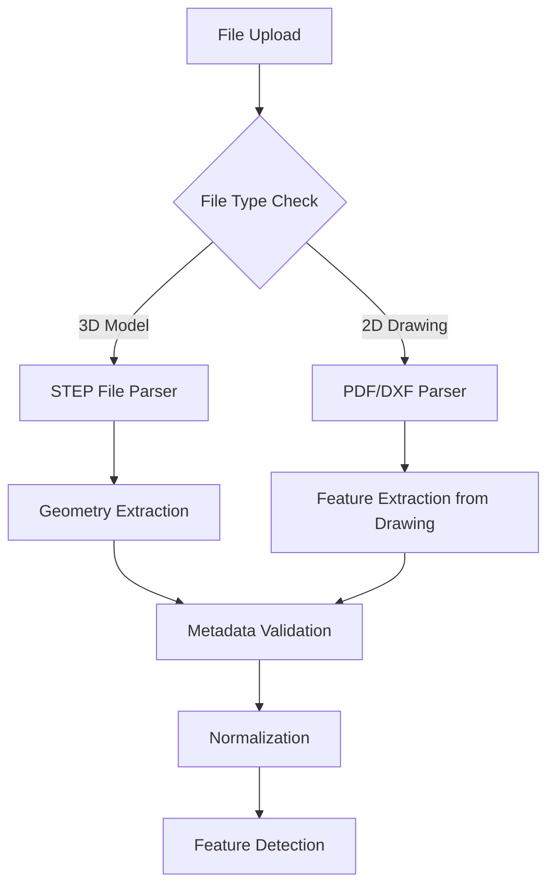
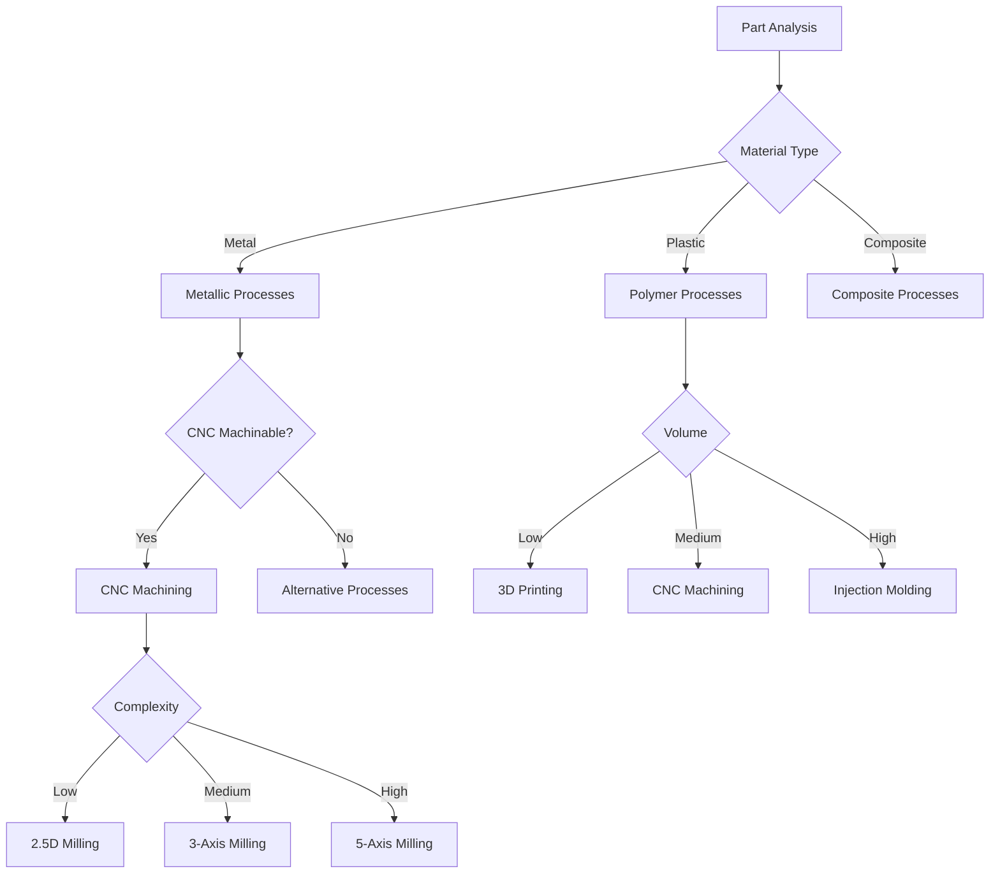

# Cost Estimation Engine Algorithm for Manufacturing

## Overview

This document describes a comprehensive algorithm for a cost estimation engine tailored for Indian manufacturing standards, specifically for industrial cities like Pune and Ahmedabad. The system processes 3D STEP files and engineering drawings to provide accurate cost estimates for custom manufactured parts.

## System Architecture

```
┌─────────────────────────────────────────────────────────────────────┐
│                        USER INTERFACE                                  │
├─────────────────────────────────────────────────────────────────────┤
│  ┌─────────────────┐    ┌─────────────────┐    ┌─────────────────┐  │
│  │  Upload Section  │    │ Configuration    │    │   Results       │  │
│  │ - STEP Files     │    │ - Process Type   │    │ - Cost Breakdown│  │
│  │ - PDF Drawings   │    │ - Material       │    │ - Timeline      │  │
│  │ - Rate Card      │    │ - Quantity       │    │ - DFM Feedback  │  │
│  └─────────────────┘    └─────────────────┘    └─────────────────┘  │
└─────────────────────────────────────────────────────────────────────┘
                              │
                              ▼
┌─────────────────────────────────────────────────────────────────────┐
│                      CORE PROCESSING ENGINE                             │
├─────────────────────────────────────────────────────────────────────┤
│  ┌─────────────────┐    ┌─────────────────┐    ┌─────────────────┐  │
│  │  File Parser     │    │ Geometry         │    │ Cost Calculator  │  │
│  │ - STEP Analysis  │◄───►│ Analysis         │◄───►│ - Rate Card      │  │
│  │ - PDF Extraction │    │ - Volume         │    │   Integration    │  │
│  │ - Feature        │    │ - Surface Area   │    │ - Indian Rates   │  │
│  │   Detection      │    │ - Weight         │    │   Database       │  │
│  └─────────────────┘    │ - Perimeter      │    │ - Fallback AI    │  │
│                         │ - Bounding Box    │    │   Module         │  │
│                         │ - Feature Count   │    └─────────────────┘  │
│                         └─────────────────┘                          │
└─────────────────────────────────────────────────────────────────────┘
                              │
                              ▼
┌─────────────────────────────────────────────────────────────────────┐
│                      DATABASE & AI LAYER                               │
├─────────────────────────────────────────────────────────────────────┤
│  ┌─────────────────┐    ┌─────────────────┐    ┌─────────────────┐  │
│  │ Material DB      │    │ Process DB       │    │ AI Model         │  │
│  │ - Indian Standards│   │ - Machining      │    │ - Feature        │  │
│  │ - Stock Sizes    │    │ - Sheet Metal    │    │   Recognition    │  │
│  │ - Properties     │    │ - Injection      │    │ - Similarity     │  │
│  └─────────────────┘    │   Molding        │    │   Matching       │  │
│                         │ - 3D Printing     │    │ - Cost Prediction│  │
│                         └─────────────────┘    └─────────────────┘  │
└─────────────────────────────────────────────────────────────────────┘
```

---

## Step 1: File Upload and Preprocessing

### 1.1 Supported File Formats
- **3D Models**: STEP (.step, .stp), IGES (.igs), STL (.stl), SOLIDWORKS (.sldprt), Fusion 360 (.f3d)
- **Drawings**: PDF (with vector data preferred), DXF, DWG

### 1.2 File Processing Pipeline



### 1.3 STEP File Metadata Extraction

The system extracts the following mathematical metadata from STEP files:

#### Volume Calculation
```
Volume = ∫∫∫ dV over the part geometry
```
- **Method**: B-Rep (Boundary Representation) decomposition
- **Units**: mm³, cm³, in³ (converted to standard)
- **Accuracy**: ±0.1% of actual volume

#### Surface Area Calculation
```
Surface Area = Σ (Area of all faces)
```
- **Method**: Triangle mesh approximation or exact NURBS surface calculation
- **Units**: mm², cm², in²
- **Includes**: External surfaces only (configurable for internal features)

#### Weight Calculation
```
Weight = Volume × Material Density
```
- **Density Database**: Material-specific densities (Indian standard materials)
- **Units**: kg, g, lbs
- **Example Densities**:
  - Mild Steel: 7.85 g/cm³
  - Aluminum 6061: 2.70 g/cm³
  - Brass: 8.40 g/cm³
  - ABS Plastic: 1.04 g/cm³

#### Perimeter Calculation
```
Perimeter = Σ (Length of all external edges)
```
- **Method**: Edge traversal algorithm
- **Units**: mm, cm, inches
- **Use Case**: Sheet metal cutting, laser cutting cost estimation

#### Bounding Box Dimensions
```
Bounding Box = [minX, minY, minZ, maxX, maxY, maxZ]
```
- **Purpose**: Stock size comparison, machine bed requirement check
- **Units**: mm (primary), inches (secondary)

---

## Step 2: Feature Detection and Analysis

### 2.1 Geometric Feature Identification

The system identifies and categorizes manufacturing-relevant features:

#### Primary Features
| Feature Type | Detection Method | Cost Impact | Manufacturing Process |
|--------------|------------------|-------------|---------------------|
| Holes | Circular edge detection, through/blind classification | High | Drilling, Boring |
| Pockets | Face depression analysis, depth measurement | High | Milling |
| Slots | Linear feature with parallel faces | Medium | Milling, Broaching |
| Bosses | Protrusion detection, height measurement | Medium | Milling, Turning |
| Fillets/Chamfers | Edge rounding detection, angle measurement | Low | Secondary operations |
| Threads | Helical feature detection, pitch analysis | Medium | Tapping, Thread Milling |
| Tabs | Extended protrusions | Low | Cutting, Machining |
| Notches | Edge interruptions | Low | Cutting, Machining |

#### Complexity Metrics
```
Complexity Score = (Feature Count × Feature Weights) + (Tolerance Factor) + (Surface Finish Factor)
```

### 2.2 Manufacturing Process Determination

Based on detected features and part geometry, the system determines applicable manufacturing processes:



### 2.3 Stock Size Comparison Algorithm

```
Algorithm: FindNearestStockSize(partDimensions, stockDatabase)
Input: partDimensions (length, width, height, boundingBox)
       stockDatabase (array of standard stock sizes)
Output: optimalStockSize, materialUtilization, wastePercentage

Steps:
1. Filter stock sizes by material type
2. For each dimension (L, W, H):
   a. Find smallest stock size ≥ part dimension
   b. Calculate utilization ratio = partDimension / stockDimension
3. Calculate overall material utilization:
   utilization = (partVolume / stockVolume) × 100
4. Calculate waste percentage:
   waste = 100 - utilization
5. Select stock size with:
   - Highest utilization ratio
   - Lowest waste percentage
   - Lowest cost per unit volume
6. Return optimal stock size with cost implications
```

#### Indian Standard Stock Sizes (Reference)

**Sheet Metal (mm)**:
- Mild Steel: 1000×2000, 1250×2500, 1500×3000, 2000×4000
- Stainless Steel: 1000×2000, 1250×2500, 1500×3000
- Aluminum: 1000×2000, 1250×2500, 2000×4000
- Thickness: 0.5, 0.8, 1.0, 1.2, 1.5, 2.0, 2.5, 3.0, 4.0, 5.0, 6.0, 8.0, 10.0, 12.0, 15.0, 20.0

**Bar Stock (mm)**:
- Round: Ø6 to Ø300 in increments of 1mm
- Square: 5×5 to 100×100 in increments of 1mm
- Hex: 8AF to 75AF (Across Flats)
- Flat: 3×10 to 50×300

**Plate Stock (mm)**:
- 1000×2000, 1500×3000, 2000×4000
- Thickness: 6, 8, 10, 12, 15, 20, 25, 30, 40, 50, 60, 80, 100

---

## Step 3: Cost Calculation Algorithm

### 3.1 Base Cost Components

```
Total Cost = Material Cost + Processing Cost + Setup Cost + Tooling Cost + Overhead + Profit Margin
```

#### Material Cost Calculation
```
Material Cost = (Part Weight × Material Rate) + (Waste Material × Material Rate × Waste Factor)

Where:
- Part Weight = Volume × Density
- Material Rate = Rate card value or system default (Indian rates)
- Waste Factor = 1.0 to 1.3 (depending on process and complexity)
```

**Indian Material Rates (2026 Estimates - Pune/Ahmedabad)**:
| Material | Rate (INR/kg) | Rate (INR/mm³) |
|----------|---------------|-----------------|
| Mild Steel (MS) | 60-80 | 0.000048-0.000064 |
| Stainless Steel 304 | 250-300 | 0.000200-0.000240 |
| Stainless Steel 316 | 350-400 | 0.000280-0.000320 |
| Aluminum 6061 | 200-250 | 0.000054-0.000068 |
| Brass | 450-550 | 0.000378-0.000462 |
| Copper | 700-800 | 0.000623-0.000712 |
| ABS Plastic | 150-200 | 0.000156-0.000208 |
| Nylon | 250-300 | 0.000260-0.000312 |
| Polycarbonate | 300-350 | 0.000312-0.000364 |

#### Processing Cost Calculation
```
Processing Cost = Σ (Process Time × Hourly Rate) for all required processes
```

**Process Time Calculation**:
- **CNC Machining**: Based on toolpath length, material removal rate, feed rates
- **Sheet Metal**: Based on cut length, bend count, punch count
- **Injection Molding**: Cycle time × number of cavities
- **3D Printing**: Layer height, part volume, print speed

**Indian Process Rates (2026 Estimates - Pune/Ahmedabad)**:
| Process | Hourly Rate (INR) | Rate per Unit |
|---------|-------------------|---------------|
| CNC Milling (3-axis) | 800-1200 | - |
| CNC Turning | 700-1000 | - |
| CNC Milling (5-axis) | 1500-2000 | - |
| Laser Cutting | 150-200 per hour | 2-5 per mm cut |
| Plasma Cutting | 100-150 per hour | 1-3 per mm cut |
| Waterjet Cutting | 200-250 per hour | 3-6 per mm cut |
| Sheet Metal Bending | 80-120 per bend | - |
| Sheet Metal Punching | 50-80 per punch | - |
| Drilling | 50-100 per hole | - |
| Tapping | 80-120 per hole | - |
| Injection Molding | 1500-2500 per hour | - |
| 3D Printing (FDM) | 200-300 per hour | - |
| 3D Printing (SLA) | 300-400 per hour | - |
| Wire EDM | 1200-1800 per hour | - |
| Surface Grinding | 600-800 per hour | - |
| Cylindrical Grinding | 700-900 per hour | - |

#### Setup Cost Calculation
```
Setup Cost = Setup Time × Hourly Rate
```
- **Setup Time**: Based on process complexity (15-120 minutes typical)
- **Reduction**: Multiple identical parts share setup cost

#### Tooling Cost Calculation
```
Tooling Cost = Tool Cost / Tool Life × Number of Parts
```
- **Tool Life**: Based on material and process
- **For Injection Molding**: Mold cost amortized over production volume

### 3.2 Process-Specific Cost Algorithms

#### CNC Machining Cost Algorithm
```
CNC Machining Cost = Material Cost + 
                    (Machining Time × Hourly Rate) + 
                    (Setup Time × Hourly Rate) + 
                    (Tool Cost × Tool Wear Factor) + 
                    (Machine Overhead × Time)

Machining Time = (Volume to Remove / Material Removal Rate) + 
                (Tool Path Length / Feed Rate) + 
                (Rapid Traverse Time)

Material Removal Rate = Feed Rate × Depth of Cut × Width of Cut
```

**Material Removal Rates (mm³/min)**:
| Material | Roughing | Finishing |
|----------|----------|-----------|
| Mild Steel | 500-1000 | 100-300 |
| Stainless Steel | 200-500 | 50-150 |
| Aluminum | 1000-2000 | 300-800 |
| Brass | 800-1500 | 200-500 |

#### Sheet Metal Cost Algorithm
```
Sheet Metal Cost = Material Cost + 
                  (Cut Length × Rate per mm) + 
                  (Bend Count × Bend Rate) + 
                  (Punch Count × Punch Rate) + 
                  (Setup Cost / Batch Size) + 
                  (Tooling Cost / Batch Size)

Cut Length = Perimeter + Internal Cutouts
Bend Count = Number of bends in part
Punch Count = Number of holes/punches
```

#### Injection Molding Cost Algorithm
```
Injection Molding Cost = (Mold Cost / Production Volume) + 
                        (Cycle Time × Hourly Rate) + 
                        (Material Cost per Part) + 
                        (Machine Overhead × Cycle Time)

Cycle Time = Injection Time + Cooling Time + Ejection Time + Reset Time
Mold Cost = Base Cost × Cavity Count × Complexity Factor
```

**Injection Molding Parameters (Indian Standards)**:
| Parameter | Value Range |
|-----------|-------------|
| Cycle Time (Simple) | 20-40 seconds |
| Cycle Time (Complex) | 40-120 seconds |
| Mold Life | 100,000 - 1,000,000 shots |
| Mold Cost (Single Cavity) | ₹50,000 - ₹5,00,000 |

#### 3D Printing Cost Algorithm
```
3D Printing Cost = (Material Volume × Material Rate) + 
                  (Print Time × Hourly Rate) + 
                  (Setup Cost) + 
                  (Post-Processing Cost)

Print Time = (Layer Height / Print Speed) × Number of Layers × Part Height
```

**3D Printing Rates (Indian Standards)**:
| Material | Rate (INR/g) | Rate (INR/cm³) |
|----------|--------------|-----------------|
| PLA | 5-8 | 5-8 |
| ABS | 6-10 | 6-10 |
| PETG | 8-12 | 8-12 |
| Nylon | 15-20 | 12-16 |
| Carbon Fiber | 25-35 | 20-28 |
| Resin (SLA) | 10-15 | 10-15 |

### 3.3 Overhead and Profit Margin

```
Overhead = (Direct Cost × Overhead Percentage)
Profit Margin = (Total Cost before Profit × Profit Percentage)

Where:
- Overhead Percentage: 20-40% (Indian manufacturing standards)
- Profit Percentage: 10-30% (depending on competition and market)
```

---

## Step 4: Rate Card Integration

### 4.1 Rate Card Upload System

```
Rate Card Structure:
{
  "organization": "TechNewity",
  "location": "Pune",
  "currency": "INR",
  "lastUpdated": "2026-06-26",
  "materials": [
    {
      "name": "Mild Steel",
      "grade": "IS 2062",
      "ratePerKg": 70,
      "ratePerUnit": null,
      "unit": "kg"
    },
    {
      "name": "Aluminum 6061",
      "grade": "IS 737",
      "ratePerKg": 220,
      "ratePerUnit": null,
      "unit": "kg"
    }
  ],
  "processes": [
    {
      "name": "CNC Milling (3-axis)",
      "hourlyRate": 1000,
      "setupTime": 30,
      "setupRate": 1000
    },
    {
      "name": "Laser Cutting",
      "hourlyRate": 180,
      "ratePerMm": 3,
      "setupTime": 15,
      "setupRate": 180
    }
  ],
  "overheads": {
    "percentage": 30,
    "fixedCost": 0
  },
  "profitMargin": 20
}
```

### 4.2 Fallback Mechanism

```
Algorithm: GetRate(process, material, rateCard, systemDefaults)
Input: process, material, rateCard (user-uploaded or null), systemDefaults
Output: applicable rate

Steps:
1. If rateCard exists and contains rate for process/material:
   a. Return rateCard rate
2. Else if systemDefaults contains rate for process/material:
   a. Return systemDefaults rate (Indian standards)
3. Else:
   a. Use AI prediction model based on:
      - Material properties
      - Process complexity
      - Regional averages (Pune/Ahmedabad)
      - Historical data
   b. Return predicted rate with confidence score
```

### 4.3 AI Fallback Module

The AI module uses machine learning to predict costs when rate cards are unavailable:

**Input Features**:
- Part geometry (volume, surface area, bounding box)
- Material type and properties
- Feature count and complexity
- Required tolerances
- Surface finish requirements
- Quantity

**Model Types**:
1. **Regression Model**: Predicts cost based on historical data
2. **Similarity Matching**: Finds similar parts in database and adjusts for differences
3. **Neural Network**: Deep learning model trained on Indian manufacturing data

**Confidence Threshold**:
- High confidence (>80%): Use AI prediction directly
- Medium confidence (50-80%): Use AI prediction with manual review flag
- Low confidence (<50%): Require manual input

---

## Step 5: Manufacturing Process Selection

### 5.1 Process Feasibility Matrix

| Process | Material | Min Quantity | Max Quantity | Tolerance | Surface Finish | Cost Range |
|---------|----------|--------------|--------------|-----------|----------------|------------|
| CNC Machining | All | 1 | 1000 | ±0.05mm | Ra 0.8-3.2 | High |
| Sheet Metal | Metals | 1 | 10000 | ±0.1mm | Ra 1.6-6.3 | Medium |
| Injection Molding | Plastics | 1000 | 100000+ | ±0.1mm | Ra 0.4-1.6 | Low (high volume) |
| 3D Printing | Plastics, Metals | 1 | 100 | ±0.1mm | Ra 3.2-12.5 | High |
| Die Casting | Non-ferrous | 500 | 50000 | ±0.1mm | Ra 1.6-3.2 | Medium |
| Laser Cutting | Sheet Metals | 1 | 10000 | ±0.1mm | Ra 1.6-6.3 | Low-Medium |
| Waterjet Cutting | All | 1 | 1000 | ±0.2mm | Ra 3.2-6.3 | Medium |
| Wire EDM | Conductive | 1 | 100 | ±0.02mm | Ra 0.4-1.6 | High |

### 5.2 Process Selection Algorithm

```
Algorithm: SelectOptimalProcess(part, quantity, requirements)
Input: part (geometry, features, material), quantity, requirements (tolerance, finish)
Output: recommendedProcess, alternativeProcesses, costComparison

Steps:
1. Filter processes by material compatibility
2. Filter by quantity range
3. Filter by tolerance requirements
4. Filter by surface finish requirements
5. For remaining processes:
   a. Calculate estimated cost
   b. Calculate estimated lead time
   c. Calculate quality score
6. Rank processes by:
   - Cost (40% weight)
   - Lead Time (25% weight)
   - Quality (20% weight)
   - Feasibility (15% weight)
7. Return top 3 recommendations
```

---

## Step 6: Cost Breakdown and Reporting

### 6.1 Cost Breakdown Structure

```json
{
  "quoteId": "TNE-2026-0001",
  "partName": "Bracket Assembly",
  "createdAt": "2026-06-26T10:00:00+05:30",
  "currency": "INR",
  "summary": {
    "totalCost": 15850,
    "unitCost": 158.50,
    "quantity": 100,
    "leadTimeDays": 7,
    "confidenceScore": 92
  },
  "costBreakdown": {
    "material": {
      "cost": 5200,
      "weightKg": 26,
      "material": "Mild Steel",
      "ratePerKg": 70,
      "wastePercentage": 15
    },
    "processing": {
      "cncMilling": {
        "cost": 6500,
        "timeHours": 6.5,
        "hourlyRate": 1000
      },
      "drilling": {
        "cost": 1200,
        "holeCount": 40,
        "ratePerHole": 30
      }
    },
    "setup": {
      "cost": 1500,
      "timeHours": 1.5,
      "hourlyRate": 1000
    },
    "tooling": {
      "cost": 850,
      "description": "Drill bits, end mills"
    },
    "overhead": {
      "cost": 2100,
      "percentage": 30
    },
    "profit": {
      "cost": 2100,
      "percentage": 20
    }
  },
  "manufacturingProcess": {
    "primary": "CNC Milling (3-axis)",
    "secondary": ["Drilling", "Deburring"],
    "alternatives": [
      {
        "process": "Laser Cutting + Bending",
        "estimatedCost": 18500,
        "savings": -2700
      }
    ]
  },
  "stockSize": {
    "selected": "1000x2000x10mm MS Sheet",
    "utilization": 78,
    "wastePercentage": 22
  },
  "dfmFeedback": {
    "warnings": [
      "Sharp internal corners may require fillets",
      "Hole diameter too small for standard drills"
    ],
    "recommendations": [
      "Increase hole diameter to 5mm for cost reduction",
      "Add 1mm radius to internal corners"
    ]
  },
  "rateCardUsed": "TechNewity_Pune_2026",
  "fallbackUsed": false
}
```

### 6.2 DFM (Design for Manufacturing) Feedback

The system provides automated DFM feedback to optimize designs for cost:

**Geometric Checks**:
- Minimum hole size (material-dependent)
- Minimum wall thickness
- Corner radii requirements
- Draft angles for molding
- Undercut detection

**Manufacturability Checks**:
- Feature accessibility for machining
- Tool clearance requirements
- Fixturing feasibility
- Tolerance stack-up analysis

**Cost Optimization Suggestions**:
- Material substitution recommendations
- Feature simplification opportunities
- Standard feature usage (holes, slots)
- Symmetry recommendations

---

## Step 7: Indian Standards and Regional Considerations

### 7.1 Material Standards (Indian)

**Steel**:
- IS 2062: Hot rolled medium and high tensile structural steel
- IS 226: Structural steel (standard quality)
- IS 1570: Wrought steel for general engineering purposes
- IS 5517: Stainless steel bars and flats

**Aluminum**:
- IS 737: Wrought aluminum and aluminum alloys
- IS 736: Aluminum alloy ingots

**Copper and Brass**:
- IS 191: Copper cathodes
- IS 200: Brass ingots

### 7.2 Manufacturing Standards (Indian)

- **IS 2825**: Code of practice for CNC machines
- **IS 3060**: Tolerances for machining
- **IS 919**: Surface roughness standards
- **IS 2702**: Sheet metal tolerances
- **IS 3740**: Injection molding standards

### 7.3 Regional Rate Variations

| City | Labor Cost Index | Machine Hourly Rate Index | Material Cost Index |
|------|------------------|---------------------------|---------------------|
| Pune | 1.00 | 1.00 | 1.00 |
| Ahmedabad | 0.95 | 0.95 | 0.98 |
| Mumbai | 1.15 | 1.10 | 1.05 |
| Chennai | 1.05 | 1.00 | 1.00 |
| Bangalore | 1.10 | 1.05 | 1.02 |
| Delhi | 1.05 | 1.00 | 1.00 |

**Adjustment Formula**:
```
Regional Cost = Base Cost × (City Index)
```

---

## Step 8: Implementation Roadmap

### Phase 1: Core Engine (4-6 weeks)
- [ ] STEP file parser implementation
- [ ] PDF drawing feature extraction
- [ ] Basic geometry analysis (volume, surface area, weight)
- [ ] Material database (Indian standards)
- [ ] Basic cost calculation algorithms
- [ ] Rate card upload system

### Phase 2: Advanced Features (6-8 weeks)
- [ ] Feature detection algorithms
- [ ] Stock size comparison
- [ ] Process selection logic
- [ ] DFM feedback generation
- [ ] AI fallback module (basic)
- [ ] Multi-process cost calculation

### Phase 3: Optimization (4-6 weeks)
- [ ] AI model training with Indian data
- [ ] Regional rate adjustments
- [ ] Performance optimization
- [ ] User interface enhancements
- [ ] Integration testing

### Phase 4: Deployment (2-4 weeks)
- [ ] System integration
- [ ] User acceptance testing
- [ ] Documentation
- [ ] Training materials
- [ ] Go-live support

---

## Step 9: Technical Requirements

### 9.1 Software Dependencies
- **CAD Processing**: OpenCASCADE, FreeCAD, or commercial CAD libraries
- **Geometry Analysis**: CGAL, Eigen, or custom computational geometry
- **AI/ML**: TensorFlow/PyTorch for prediction models
- **Database**: PostgreSQL or MongoDB for material/process data
- **Backend**: Node.js, Python, or Java
- **Frontend**: React, Vue.js, or Angular

### 9.2 Hardware Requirements
- **Minimum**: 8GB RAM, 4-core CPU, 500GB SSD
- **Recommended**: 16GB RAM, 8-core CPU, 1TB SSD, GPU for AI
- **Storage**: Scalable cloud storage for uploaded files

### 9.3 Data Requirements
- Indian material rate database
- Standard stock size database
- Process capability database
- Historical cost data for AI training
- Regional rate variations

---

## Step 10: Validation and Testing

### 10.1 Test Cases

| Test Case | Input | Expected Output | Validation Method |
|-----------|-------|-----------------|-------------------|
| Simple Block | 100×100×10mm MS | Cost within 5% of manual estimate | Manual calculation |
| Complex Part | STEP file with holes, pockets | Accurate feature detection | Visual inspection |
| Sheet Metal | DXF with bends | Correct cut length, bend count | CAD verification |
| Rate Card | Custom rates uploaded | Costs based on custom rates | Rate card comparison |
| Fallback | No rate card | System defaults used | Default rate verification |

### 10.2 Accuracy Metrics
- **Volume Calculation**: ±0.1% of CAD software
- **Weight Calculation**: ±0.5% of actual
- **Cost Estimation**: ±10% of actual (for standard parts)
- **Feature Detection**: 95% accuracy rate
- **Process Selection**: 90% optimal recommendation rate

---

## Appendix A: Formula Reference

### Geometric Formulas

**Volume of Common Shapes**:
- Cube: V = a³
- Rectangular Prism: V = l × w × h
- Cylinder: V = πr²h
- Sphere: V = (4/3)πr³
- Cone: V = (1/3)πr²h
- Torus: V = 2π²r²R (where R is major radius, r is minor radius)

**Surface Area of Common Shapes**:
- Cube: A = 6a²
- Rectangular Prism: A = 2(lw + lh + wh)
- Cylinder (lateral): A = 2πrh
- Cylinder (total): A = 2πr(h + r)
- Sphere: A = 4πr²
- Cone (lateral): A = πr√(r² + h²)

**Weight Calculation**:
- Weight = Volume × Density
- Density (ρ) = Mass / Volume

### Manufacturing Formulas

**Material Removal Rate (MRR)**:
- MRR = Feed Rate (f) × Depth of Cut (d) × Width of Cut (w)
- MRR = (Cutting Speed × Feed × Depth) / 60 (for turning)

**Cutting Time**:
- Time = Length of Cut / Feed Rate
- Time = Volume to Remove / MRR

**Spindle Speed (N)**:
- N = (Cutting Speed × 1000) / (π × Diameter)

**Feed Rate (F)**:
- F = N × Feed per Revolution × Number of Teeth

**Cycle Time (CNC)**:
- Cycle Time = Cutting Time + Rapid Traverse Time + Tool Change Time + Setup Time

**Cycle Time (Injection Molding)**:
- Cycle Time = Injection Time + Packing Time + Cooling Time + Ejection Time + Reset Time

---

## Appendix B: Glossary

| Term | Definition |
|------|------------|
| B-Rep | Boundary Representation - 3D model representation using surfaces, edges, vertices |
| CAD | Computer-Aided Design |
| CAM | Computer-Aided Manufacturing |
| CNC | Computer Numerical Control |
| DFM | Design for Manufacturing |
| DMLS | Direct Metal Laser Sintering |
| EDM | Electrical Discharge Machining |
| FDM | Fused Deposition Modeling |
| MRR | Material Removal Rate |
| SLA | Stereolithography |
| STL | Standard Triangle Language / Standard Tessellation Language |
| STEP | Standard for the Exchange of Product Data |

---

## Appendix C: References

1. Xometry Instant Quoting Engine - https://www.xometry.com
2. Fictiv Manufacturing Platform - https://www.fictiv.com
3. LevelPlane Cost Estimation - https://www.levelplane.com
4. Indian Standards (IS) - Bureau of Indian Standards
5. Machining Data Handbook
6. Manufacturing Engineering and Technology by Kalpakjian & Schmid

---

*Document Version: 1.0*  
*Last Updated: June 26, 2026*  
*Prepared for: TechNewity Development Team*  
*Prepared by: Cost Estimation Engine Design Team*